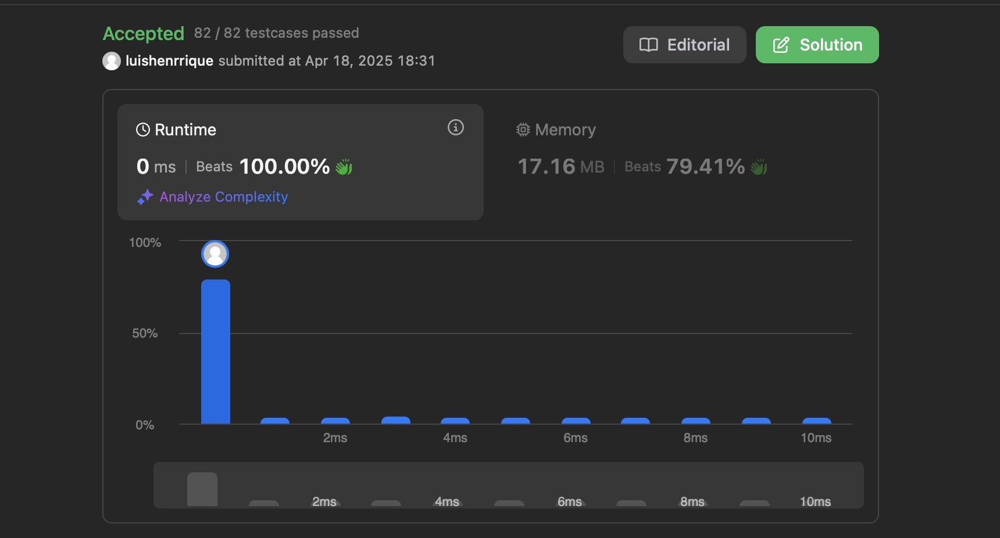
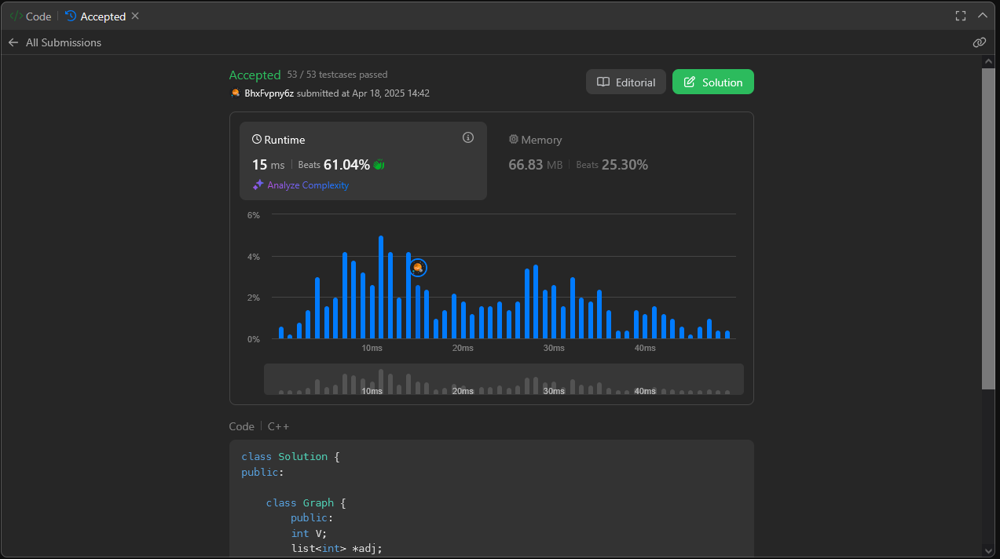
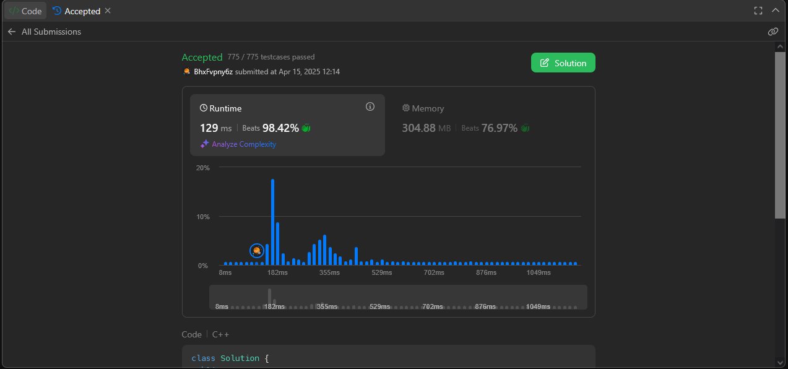

# JL

**Número da Lista**: 1 
**Conteúdo da Disciplina**: Grafos1 

## Alunos
|Matrícula | Aluno |
| -- | -- |
| 22/1022014  |  João Vitor Lopes Ribeiro |
| 18/0066161  |  Luis Henrique Luz Costa |

## Sobre 
A entrega desse Trabalho de Grafos 1 da disciplina de Projeto de Algoritmos consiste em uma seleção de questões no leetcode sobre grafos de dificuldade média e difícil envolvendo algoritmos estudados na disciplina como BFS, DFS e ordenação topológica.

| Questão | Dificuldade |
|---------|-------------|
| [Is Graph Bipartite?](https://leetcode.com/problems/is-graph-bipartite/description/) | Média |
| [Build a Matrix With Conditions](https://leetcode.com/problems/build-a-matrix-with-conditions/description/) | Difícil |
| [Critical Connections in a Network](https://leetcode.com/problems/critical-connections-in-a-network/description/) | Difícil |
| [Remove Methods From Project](https://leetcode.com/problems/remove-methods-from-project/description/) | Média |

## Screenshots

### [Is Graph Bipartite?](https://leetcode.com/problems/is-graph-bipartite/description/)

### [Build a Matrix With Conditions](https://leetcode.com/problems/build-a-matrix-with-conditions/description/)

### [Critical Connections in a Network](https://leetcode.com/problems/critical-connections-in-a-network/description/)

### [Remove Methods From Project](https://leetcode.com/problems/remove-methods-from-project/description/)

## Instalação 
**Linguagem**: C++ 

Os códigos foram feitos para solucionar os problemas na plataforma Leetcode, portanto é necessário ter uma conta na plataforma.

## Uso 

1. Faça Sign In na plataforma Leetcode;
2. Copie o código de solução do problema do repositório; 
3. Acesse a página do problema;
4. Cole o código no editor do Leetcode;
5. Submeta o código;
6. Receba o resultado do teste do código sob as entradas do problema.

## Entregas 
[Entrega - Grafos 1 (Acessar o vídeo)](https://youtu.be/4z3aK_cliZ0)
